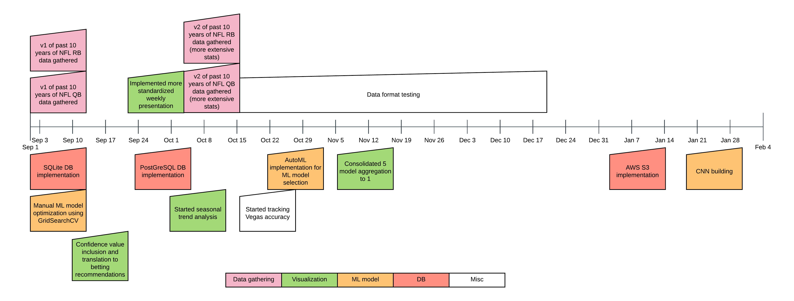

ML for NFL Game Prediction
==========================

This project is a result of iteration throughout the 2017 NFL season. It has lived through many different implementations, and as such, some remnants still remain. At the moment, the remaining TODOs are:
* Complete modularization into functionality categories according to Project Organization below
* Eliminate deprecated manual optimization, replace with AutoML pipeline
* Clean up remaining docstrings
* Determine and eliminate redundancy
* Implement a tensorflow CNN to see if results are superior/inferior

## Overview

The basic idea of the project is to:
1. Gather historical stats for QBs and RBs - two positions that arguably have the most impact on the outcome of NFL games
    * Stats gathered:

| QB               | RB                |
| ---------------- |:-----------------:|
| Team             | Team              |
| Completions      | Rushing Attempts  |
| Attempts         | Rushing Yards     |
| Yards            | Rushing TDs       |
| TDs              | Rushing Long      |
| Interceptions    | Receiving Targets |
| Sacks            | Receiving Yards   |
| Sack Yards       | Receiving TDs     |
| QB Rating        | Receiving Long    |
| Completion Long  | Total Touches     |
| Rushing Attempts | Week              |
| Rushing Yards    | Season            |
| Rushing TDs      | Opposing Team     |
| Rushing Long     | Score             |
| Fumbles          | Score against     |
| Fumbles Lost     | Win/Loss          |
| Week             |                   |
| Season           |                   |
| Opposing Team    |                   |
| Score            |                   |
| Score against    |                   |
| Win/Loss         |                   |

2. Generate cumulative summation numbers for each game for each player
3. Merge the QB and RB data on a per-game basis
4. Format the data to make it ML-friendly (done by mapping players and teams to an id in a psql table)
5. Use this merged data to feed into an AutoML pipeline to iterate over hyperparameters and models
6. Gather the starting RBs and QBs in the games you want to predict (has to be done close to gametime for accurate starter information)
7. Pull the cumulative summation data for each player playing & merge QB and RB data on a per-game basis. Format to reflect training data
8. Use the optimal model output of the AutoML pipeline to predict the NFL games of interest
9. Use the confidence values for each prediction as a percentage scale to recommend amount of money to bet on each game

## Usage

The project requires credentials to be stored in `config.txt`. At the moment there is only support for an S3 bucket or attached PostGreSQL DB, so one of those should be fulfilled prior to usage.

Generally, the workflow above can be seen in use in `src/test/2017_retro_code.py`, which is what was used for the 2017 season retrospective. The only difference is the model used was pre-generated from an AutoML pipeline in order to skip the training process.

## Timeline

For a sense of how I came to this point, here is a timeline of the project:

Since there were too many iterations to denote in the timeline, the Data Format Testing cases consisted of:
* Merging different number and types of players per game:

| Test Case | Players Included Per Game |
| --------- |:-------------------------:|
| 1 | Starting Home QB   Starting Home RB1|
| 2 | Starting Home QB   Starting Home RB1   Starting Home RB2 |
| 3 | Starting Home QB   Starting Home RB1   Starting Away QB   Starting Away RB1 |
| 4 | Starting Home QB   Starting Home RB1   Starting Home RB2   Starting Away QB   Starting Away RB1   Starting Away RB2 |
| 5 | Starting Home QB   Starting Home RB   Starting Home WR1 |
| 6 | Starting Home QB   Starting Home RB1   Starting Home WR1   Starting Away QB   Starting Away RB1   Starting Away WR1 |

* Using cumulative summation, rolling average, or raw stats for training
* Iterating over which stats to use for each position
* Determining inter and intra-season weights

Project Organization
------------

    ├── LICENSE
    ├── Makefile           <- Makefile with commands like `make data` or `make train`
    ├── README.md          <- The top-level README for developers using this project.
    │
    ├── models             <- Trained and serialized models, model predictions, or model summaries
    │
    ├── notebooks          <- Jupyter notebooks. Naming convention is a number (for ordering),
    │                         the creator's initials, and a short `-` delimited description, e.g.
    │                         `1.0-jqp-initial-data-exploration`.
    │
    ├── references         <- Data dictionaries, manuals, and all other explanatory materials.
    │
    ├── reports            <- Generated analysis as HTML, PDF, LaTeX, etc.
    │   └── figures        <- Generated graphics and figures to be used in reporting
    │
    ├── requirements.txt   <- The requirements file for reproducing the analysis environment, e.g.
    │                         generated with `pip freeze > requirements.txt`
    │
    ├── src                <- Source code for use in this project.
    │   ├── __init__.py    <- Makes src a Python module
    │   │
    │   ├── data           <- Scripts to download or generate data
    │   │   └── make_dataset.py
    │   │
    │   ├── models         <- Scripts to train models and then use trained models to make
    │   │   │                 predictions
    │   │   ├── predict_model.py
    │   │   └── train_model.py
    │   │
    │   └── visualization  <- Scripts to create exploratory and results oriented visualizations
    │       └── visualize.py
    │
    └── tox.ini            <- tox file with settings for running tox; see tox.testrun.org

--------

### LICENSE: [MIT](https://choosealicense.com/licenses/mit/)

